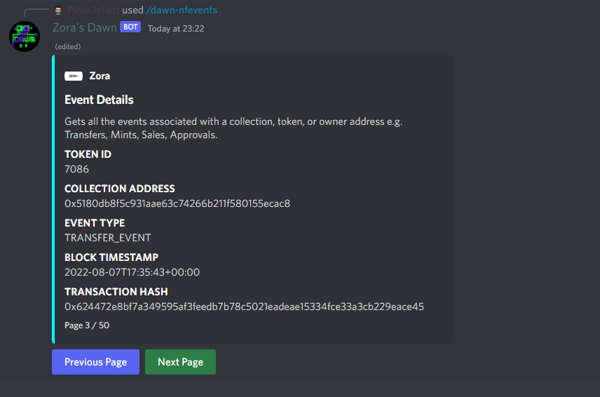

# dawn-nfevents

Gets **statistics** on all the **attributes** for a **collection**.

## Syntax

`/dawn-nfevents <collection_address> <token_id> <event_type>`

## Parameters

| Name               | Explanation                                              | Optional     |
| ------------------ | ---------------------------------------------------------| ------------ |
| collection_address | String of collection address to filter by                | false        |
| token_id           | Enter the Token ID to filter by                          | true         |
| event_type         | A String of EventType	                                  | true         |

## Example

