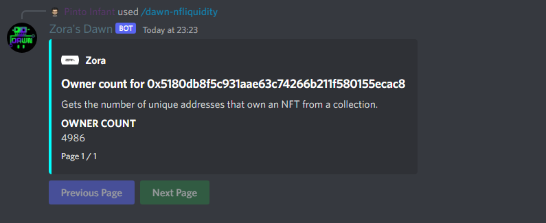

# dawn-nfliquidity

Gets the **number** of **unique addresses** that own an **NFT** from a **collection**.

## Syntax

`/dawn-nfliquidity <collection_address>`

## Parameters

| Name               | Explanation                               | Optional     |
| ------------------ | ----------------------------------------- | ------------ |
| collection_address | String of collection address to filter by | false        |

## Example

