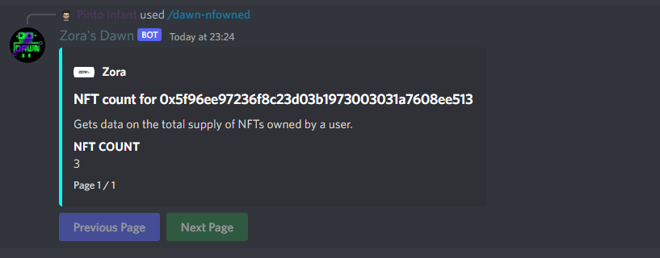

# dawn-nfowned

Gets **data** on the **total supply** of NFTs owned by a **user**.

## Syntax

`/dawn-nfowned <wallet_address>`

## Parameters

| Name               | Explanation                               | Optional     |
| ------------------ | ----------------------------------------- | ------------ |
| wallet_address     | String of owner address to filter by      | false        |

## Example

