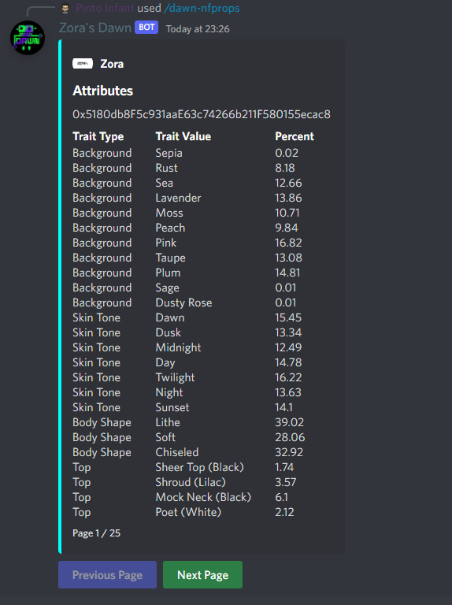

# dawn-nfprops

Gets **statistics** on all the **attributes** for a **collection**.

## Syntax

`/dawn-nfprops <collection_address> <token_id>`

## Parameters

| Name               | Explanation                                                  | Optional
| ------------------ | ------------------------------------------------------------ | ----------
| collection_address | String of collection address to filter by                    | false
| token_id           | A string for the tokenId to return a token for               | true

## Example

